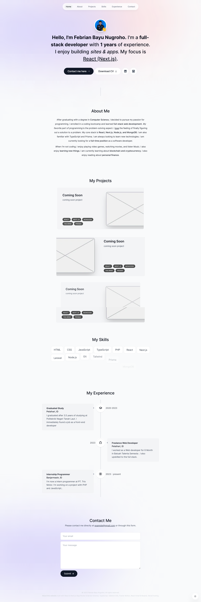

## Stack

- Latest Next.js 13 features
- Next.js App Router
- Next.js Server Actions
- Client & Server Components
- TypeScript (Beginner & Intermediate)
- Tailwind CSS
- Context API
- Advanced Animations with Framer Motion
- React.Email & Resend
- Custom React hooks
- Fresh, modern UI design
- Light & Dark mode
- Responsive website

## Setup

1. Add RESEND_API_KEY environment variable in .env.local
2. In the send-email.ts action file, change the "to" email to your own email
3. Run `npm install`
4. Run `npm run dev`

## Project Structure

- pages: Next.js pages
- components: React components
- actions: Server actions
- hooks: Custom React hooks
- context: Context API
- styles: Tailwind CSS styles
- public: Static assets

## [Live Demo](devbyfebrian.tech)

## Preview

## License

This project is licensed under the MIT License. See the [LICENSE]
